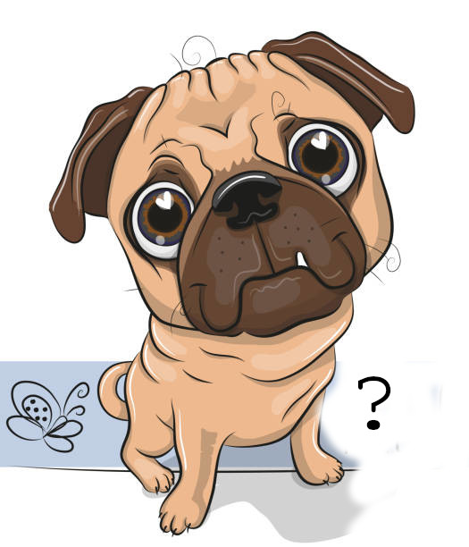

#+OPTIONS: toc:nil
#+MACRO: redcross @@html:&#10006;@@
#+MACRO: grchk @@html:&#10004;@@
#+TITLE: Pugofer Philosophy
<<philosophy_id>>
** From the Platonic Dictionary
:PROPERTIES:
:UNNUMBERED: notoc
:END:
- <<pug_id>> Pug ::
     #+ATTR_HTML: :width 180px :style float:right; margin-left:1em;
     
  1. (common noun) A small domesticated pet, known for a formidable face, an amiable disposition, obedience, curiosity and an unflinching commitment to type-boundaries.
  2. (proper noun) This particular Pug. The most noteworthy aspect of its personality being the '?'
     @@html:<small><small>[Did you notice it?]</small></small>@@
  3. (acronym) *P*​latonic *U*​niverse for *G*​eeks
  4. (short form) The short-form and executable name for Pugofer ([[pugofer_id][q.v.]])
  5. The edition of Gofer ([[gofer_id][q.v.]]) that's currently in use;\\
     the most visible difference between Gofer and Pug being the Dijkstra-dot ([[dijkstra_id][q.v.]]).
- <<pugofer_id>> Pugofer ::
  1. (archaic last century usage) *P*​une *U*​niversity's *Gofer* ([[gofer_id][q.v.]])
  2. (acronym) *P*​latonic *U*​niverse that's *GO*​od *F*​or *E*​quational *R*​easoning
  3. (curial) The philosophy of which ~pug~ ([[pug_id][q.v.]]) is the executable
- <<gofer_id>>Gofer ::
  1. (acronym) *GO*​od *F*​or *E*​quational *R*​easoning, a functional programming language and early implementation of Haskell
  2. (short form) Part of Mark P. Jones award-winning [[https://web.cecs.pdx.edu/~mpj/pubs/esop92.html][PhD Thesis]]
  3. (common mistake) $Gofer \ne Gopher$
  4. (common sloppy usage) $Gofer = Pug$ 
  5. (historical) The trunk from which pug ([[pug_id][q.v.]]) is forked
- Haskell ::
  1. The *technology* ancestor to Pug in 1990 ([[https://en.wikipedia.org/wiki/Haskell][c.f.]]);\\
    Whereas the *philosophy* [[philosophy_id][(q.v.)]] of Pugofer has greatly diverged by 2027.
  2. The first name of the logician Haskell B. Curry
- <<dijkstra_id>> Dijkstra :: A dotty Dutch guy ([[doting_dot_id][q.v.]]) whose dot-y creation ([[https://www.cs.utexas.edu/~EWD/transcriptions/EWD13xx/EWD1300.html][c.f.]]) is the most visible difference between Haskell and pug.
- <<recursion-id>> Recursion :: ([[recursion-id][q.v.]]) [[pug_id][Also see]]
#+TOC: headlines 3
* Functional {{{redcross}}}  —  Platonic {{{grchk}}}
The term /functional programming/ has become a tired misnomer with unfortunate consequences.\\
Lets correct this via a series of terminological corrections:
- Functional Programming :: Well sure that's how it starts (and I started with Lisp and didn't know lisp was not properly functional until reading Turner@@ and Wadler@@ decades later).\\
  From Fortran on, programming has been centered around *writing* functions.\\
  #+begin_quote
  Note: From C on — Perl, Python even more so — there are only functions.
  Pascal is more functional than C is more functional than Python since
  in Pascal =PROCEDURE= and =FUNCTION= is a fundamental ontic separation; in C it remains but is downgraded to =void= function; in Python the ontology completely disappears though the concept remains. “​=None=​-returning” doesn't really cut it.
  #+end_quote

  So clearly 'functional' misses the point of functional programming so-called.\\
  A more illuminating term was the older...
- Applicative Programming :: More to the point than functional but too syntactic
- Mathematical Programming :: More semantic but too broad
- Declarative Programming :: even better
- Platonic Programming :: The purpose of this document!

Note that going from:
- ‘functional’ to ‘applicative’ :: Change of emphasis from making functions to using them
- ‘applicative’ to ‘mathematical’ :: Semantics and not just syntax is the focus. [Note the appearance of the Dijkstra-dot]
- ‘mathematical’ to ‘declarative’ :: Drill into what is the nature of the math that Pugofer encourages
- ‘declarative’ to ‘Platonic’ :: the crowning of the commitment to a semantics-first view.
** What “Platonic” Means Here
A focus on
1. /Discovering/ over /Inventing/
2. Timeless /Values/ over changing /Objects/
3. /Expressions/ carry most of the syntactic load; No /Statements/
4. “Look! Don't Think!” — patterns everywhere
5. Evaluation rather than execution
6. Types represent design decision and not merely compiler optimization directives
7. Guiding Metaphor is managing or delegation (recursion) rather than following or executing a recipe (iteration)
** platonism : Platonism :: abstract : concrete
For the last hundred years or so (after Cantor, then Hilbert) platonism stood for the belief amongst mathematicians in the “reality” of abstract objects.

Needless to say the word “abstract” made people, especially those already suspicious of Cantor, still more suspicious.  If it's an abstraction what is it an abstraction of? THAT must be the underlying reality.

#+begin_quote
Note: I like to tell my students that CS is that one odd discipline where “abstraction” is a positive word. In most other places its at best neutral: an abstract is a cut down version, mildly negative: to talk abstract it to hand-wave; or downright to hide lies under fine words
#+end_quote

Its important to remember that Plato's (Socrates') agenda was diametrically opposed to the “abstraction” view:
- /The Platonic World is the Real World/
- /The empirical/physical world is the shadow world/
[Note: Plato's original terms still remain better than the philosophical fashion —\\
/τὸ ὁρατόν/ — THE sensible (world) — really sense-able\\
/τὸ νοητὸν/ — THE intelligible (world)
]\\
When we do programming in Pug, we choose the concrete over abstract data types — ADTs. That in a nutshell is the OOP vs FP choice.
#+begin_quote
Irony: The Haskell world also talks of /ADT/ but there it means “Algebraic Data Type”. It's not clear to me how that term makes sense aside from math-arcana about Universal Algebras and so on.
#+end_quote
Pugofer is committed to the view that — at least for beginners — *All types should be concrete.*

The ~ctype~ — concrete type — construct embodies this philosophy. See [[*Ontic Before Mnemonic][Ontic before Mnemonic]]
#+begin_quote
Ironic Note: ~ctype~ is like the modern Haskell GADT. But GADTs put the cart before horse — classic ~data~ is the fundamental and GADT ~data~ as “advanced.”
#+end_quote

The Pugofer view corrects this order — the GADT style is treated as having primacy with ~data~ being a short-cut.

In short...
** Types as Thought Props
@@@ Need more on type judegements from traditional math
#+begin_quote
Programming is the empirical exploration of a Platonic universe.
#+end_quote

~[1,2] :: [Int]~
doesn't merely satisfy a type system.

It brings into being — or, if we're wearing our Platonist hat, *discovers* — an object inhabiting a very specific universe.

Whereas ~[1, True]~
isn't merely illegal syntax. It is a failed attempt to construct an inhabitant of that universe.

The type checker is drawing boundaries.

- Types are *Boundaries*
- Pug is a *protected nursery* where...
- The budding Platonist explores the Platonic world empirically.
A key guiding principle...
** Ontic Before Mnemonic
Compare the Haskell
#+begin_example
data Maybe a =
               Just a
             | Nothing
#+end_example
with the Pug
#+begin_example
ctype Maybe a where
   Just    : a -> Maybe a
   Nothing : Maybe a
#+end_example

- Haskell says *How* we expect to see the introduced entities in use
- Pug says *What* the new entities are

In short Haskell is *mnemonic*. Pug is *ontic*.

Note: Its true that the more modern GADT ~data~ syntax mirrors the Pug ~ctype~ one.
But culturally that keeps the cart before the horse — the basic ~data~ is *primary*; the GADT ~data~ is *advanced*.
** Niggles and hiccups
And there have always been issues with calling it a /functional programming language./
- Students get distressed at being sold short by not being given something ‘hot’
- Faculty get dissatisfied that the FP-fans are on a personal trip
- Yawns from curricula boards
- etc

Why are functional languages specifically under attack?

Because the alternatives — C, C++, Java, Python etc — *set the framing-rules of the programming game.*

Strangely these objectors don't object to all the theory/soft/humanistic courses that have no machine component.

What if FP were not in the league of Fortran, C, Java, Python...
But of flow charts, UML, Science of Programming, Automata Theory, Complexity Theory...?

*ie a way of THINKING about programming not DOING programming*
** Two Lineages
@@@Need an image here
Long before the modern slew of languages there was ISWIM, before that there was Denotational Semantics.
Are these quite *programming*? Or *about* programming?

Going further back the older lineage, before and unrelated to computers
The Lambda and Combinatory Calculi of Church and Schönfinkel.
Frege
Boole
Leibniz
Ramon Llul
Aristotle

Even though Pug belongs to the first as a very very junior member of the Haskell family, Pugofer represents the wish (and pretensions) to the second.

#+begin_quote
Aside: Is it fantastical to put ourselves into the company of Leibniz and Aristotle?\\
No more than when a programmer chooses (say) C++ over Python he chooses the company of Stroustrup over Guido.\\
It may seem that the company of Aristotle is more metaphysically fraught than living persons like Stroustrup.\\
But in practice Stroustrup or Guido care as little about us as Leibniz or Aristotle do...

Or Plato!

We may not matter to them; they matter to us.\\
And teachers' job is to inculcate good ideals
#+end_quote
Brings us to...
** Pug and Pugofer
*** Why “Pugofer”?
There is little point being very good at some FPL *technology* and becoming quite impotent when moving to a more conventional language.
Pugofer represents the principle that properly educated programmers should be better at a slew of languages/technologies/systems *they have not seen* than those trained within a narrow technological focus.
In short Pugofer is about a pedagogical *philosophy* of CS mastery over and above *tech details*.
*** Why “Pug”?
The name Pug reflects the conviction that programs, algorithms, types and mathematical structures are discovered as much as invented — that computing is an exploration of an abstract world. It's the *teaser technology behind the philosophy.* ‘Technology’ because its a program; ‘Teaser’ because it does not vie with Haskell or Rust or Python or any other mainstream language...
* Programming as Exploration
** Programming is the empirical exploration of a Platonic universe
Pug facilitates the exploration of a Platonic world
- The world is Platonic
- The exploration happens in an empiric world
- The programmer doing the exploration remains ever suspended between the timeless stable Platonic world and his own confusions, limitations, ignorance. Sometimes even the inherent limitations of a contingent program eg.
  #+begin_example
  ERROR: Garbage collection fails to reclaim sufficient space
  #+end_example

Note the resolution to the 2 millennial...
** Philosophy War
There has been a war for over 2 millennia between the empiricists and the rationalists (Platonists)
- Plato vs Aristotle
- Descartes vs Locke
- Kant vs Berkeley-Hume (yeah this "vs" is somewhat different) 

Pugofer doesn't take a side.
* The Hinge
#+begin_example
                 PLATONIC WORLD
          types · values · functions
          equations · structures
                    ▲
                     ╲
                       ╲
                         °    PUG 
                       ╱
                     ╱
                    ▼
             EMPIRICAL WORLD
       programmer · editor · compiler
          CPU · memory · time
#+end_example

#+begin_example
┌──────────────────────────────┐
│ PUG FILE                     │
│                              │
│ timeless / declarative       │
│ mathematical object          │
└──────────────────────────────┘
                ▲
                 ╲
                   ╲
                     °  PUG 
                   ╱
                 ╱
                ▼
┌──────────────────────────────┐
│ INTERPRETER                  │
│                              │
│ temporal / experimental      │
│ observable behavior          │
└──────────────────────────────┘
#+end_example
Pug is a hinge between two worlds — the empirical and the Platonic: it empiricizes the Platonic without compromising its truth.

#+begin_quote
If the pursuit of mathematics is essentially an intention and commitment to inhabiting a rich Platonic world, Pug is a window through which we may explore and discover that universe.
#+end_quote
** Other Aspects of the Hinge
Denotational and Operational (rewriting) semantics

- Platonic — programs are themselves first-class values
- Equational — understanding comes through reasoning — denotational — and transformation — rewriting.
- Pedagogical — the language should be teachable.

** The Pug File vs The Interpreter
The two worlds correspond to the two windows in emacs (or whichever envronment is chosen)
* Why Equational?
- Platonism is about the engagement with pure intellectual objects
- Math is the entreé into Platonism
  Its apposite to remember that Plato's agenda was primarily:
  /What is Truth, Justice? Beauty? etc/ ie  Level 1.\\
  And ultimately Level 2: /What is The Good?/\\
  Math as it turned out is the best Level 0 for building this edifice.
  
  Inscription on Plato's academy:
  #+begin_quote
  Ἀγεωμέτρητος μηδεὶς εἰσίτω
  #+end_quote
  English rendering
  #+begin_quote
  Let no one ignorant of geometry enter
  #+end_quote
- Programming is the empirical exploration of mathematical objects.
- Programs are both equations as well as executions.\\
  In fact if we think with equations and the interpreter converts these into executions, the equations *precede* the execution
- So evaluation over execution

@@ Need to expand on
- programs as equations
- equational reasoning
- denotational semantics
- rewriting / operational semantics
- why Gofer's original “Good For Equational Reasoning” matters

This also gives a natural explanation of Pugofer.
* Symmetry of Application and Equality
The promotion of application to an explicit operator (~.~) completes the algebraic symmetry between functions, values, and equality in predicate calculus:

@@@Repeating

Speaking a little over-syntactically
** Right-Sided Cancellation (Function Extensionality)

$$(\forall x \bullet f.x = g.x) \iff f = g$$

Two functions are equal if and only if their application yields identical values across all inputs.
** Left-Sided Cancellation (Leibniz's Rule)

$$(\forall f \bullet f.x = f.y) \iff x = y$$

Two values are equal if and only if every function applied to them yields identical results.

When application is hidden in whitespace ($f\;x$), this symmetry vanishes. The dot (~.~) makes application a first-class binary operator, allowing equational proofs to treat function equality
\[
(\forall x \bullet f.x = g.x) \implies f = g
\]
and value equality
\[
(\forall f \bullet f.x = f.y) \implies x = y
\]
as exact, syntactic mirrors of one another.

Ultimately, replacing hidden juxtaposition with $f.x$ makes explicit a symmetry that ordinary whitespace notation leaves implicit. The notation does not add a new mathematical fact; it prevents an existing one from being obscured.
As the discussion:
[[https://github.com/pugofer/techreports/blob/master/purgatory.pdf][Recorde, Leibniz, and Dijkstra]] adumbrates, clarity of thought follows from clarity of notation. Which means we must seek to erase all unnecessary sloppiness.

So since\\
*Committing* to Platonic objects\\
            → *Facilitates* equational reasoning by \\
                                    → *using* notation that exposes the algebra.
** Or in Phil Lingo
Ontolog(ical commitment)\\
            → Epistemolog(ical method)\\
                                    → Pedagog(ical choices, here notation)
* On Paradigms
The misuse and abuse of paradigm after [[https://www.scientificamerican.com/blog/cross-check/what-thomas-kuhn-really-thought-about-scientific-truth/][Kuhn]] ([[https://cseweb.ucsd.edu/~goguen/courses/275f00/horgan.html][shorter]]) has been more severe and pervasive in CS than in any other field to my knowledge.
** Imperative a mistake
** Functional a misnomer
** OOP a trillion dollar scam
** A better alternative paradigm proposal
It is our belief that this division of languages is far more useful
- education
- professional development
- research

Gofer was a development tour de force — mpj did it on a ordinary PC!  In 1991! It showcases significant research.  It /happened/ to be good for teaching beginners but that was never its primary purpose.

Pug
- As a technology consists of not very large changes to the Gofer codebase
- As pedagogy it has a complementary purpose — to be an amiable negotiating tool for the learning curve for programming noobs.
  See [[./pedagogy.org][Pedagogy]]
** Which is the Flagship FPL
If one were asked is there ONE flagship FPL ?
The answer would be — depends on when the conversation is happening
- From 57 into the 60s Fortran was it — the very name says so
- In the 60s-70s it was mostly lisp though in small dedicated circles it would be APL
- In the 70s into the 80s ML and its various dialects started significantly changing the game — bringing closer the prim-n-propah-ness of structured programming a la Pascal into the power and elegance of Lisp
- In the 80s into the 90s Turner's phased genesis of FPLs were it —
  (a) lazy (b) Really pure (c) Pleasing ISWIM syntax\\
  Culminating in Miranda.
*** Is there any any single language today?
Depends on which window we peer in from
- If professional devel — Scala, Clojure, even Rust
- If research Agda, Idris...
- If teaching — [[https://racket-lang.org/][Racket]], [[https://pyret.org/][Pyret]], [[https://www.microsoft.com/en-us/research/wp-content/uploads/2016/02/helium.pdf][Helium]],  [[https://www.cs.cmu.edu/~rwh/smlbook/book.pdf][SML]],  [[http://gracelang.org/documents/cseet13main-id92-p-16403-preprint.pdf][Grace]], [[https://www.roc-lang.org/][Roc]] and so on.\\
  Oh and there is this little thing called Pug — some of you may have heard of it 😉
*** Haskell
Haskell tries to belong in all 3 buckets. The very first goal of the [[https://www.haskell.org/onlinereport/haskell2010/haskellli2.html#x3-3000][report]] reads:
#+begin_quote
1. It should be suitable for teaching, research and applications including building large systems
#+end_quote
Whether and how far it succeeds in triangulating all these is [[https://mail.haskell.org/pipermail/ghc-devs/2015-October/010068.html][a matter of opinion]].\\
* Pug and Haskell
If this view is acceptable, then Haskell is facing the wrong way — its trajectory is increasing power a la C++, not more enjoyment and /Aha/!​-s for noobs.
** What pug is
You're reading that!
** What pug isn't
If the above outlined view is acceptable, then Haskell is facing the wrong way...
* The Pug Project

And perhaps:

#+begin_quote
Pugofer is the larger intellectual project;\\
Pug is its executable face.
#+end_quote

This becomes the synthesis rather than an early assertion.
* Links

- <<doting_dot_id>> Doting on the dot
- <<thought_dialogue>> Thought Dialogue with EWD
- <<breakfast_in_purgatory>> Breakfast in Purgatory 
* Hanging@@@
- exploration
- Rewriting semantics
- For a more detailed, personal (and honest!) history see [[./personal.org][Personal]]
- Note: In short Pugofer is the larger umbrella term involving programs but also philosophy and pedagogy.
